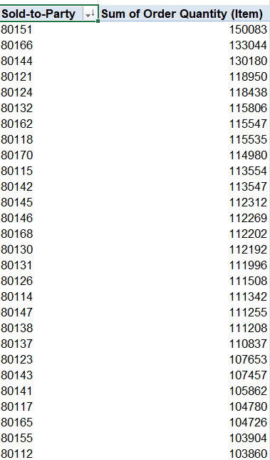
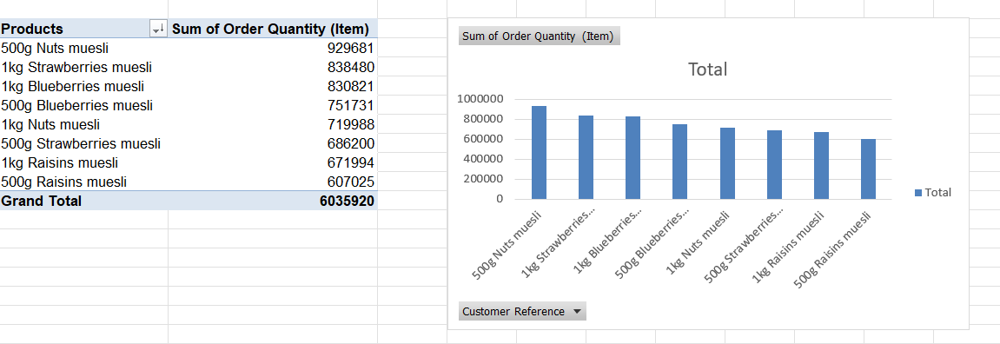
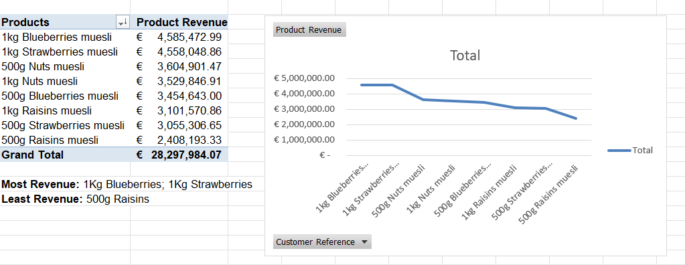
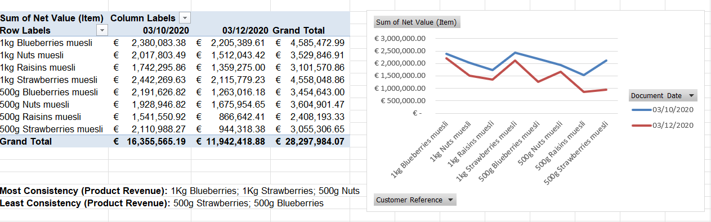

## Hi there, I'm Jacob 👋

I'm an aspiring data analyst with experience in R, Python, SQL, and econometric modeling.
I enjoy turning messy data into clear insights

🎓 BBA in Economics  
📊 Interests: econometrics, data visualization, and analytics projects  
🚀 Currently building my data analytics portfolio here on GitHub

---

## 📄 Project 1: Econometric Research Paper

**Title:** The Impact of Ability Grouping on Academic Performance   
**Topic:** An analysis of how ability grouping affects school-wide performance.

👉 [**Read the Full Research Paper (PDF)**](./Econometric%20Research%20Paper.pdf)

### Abstract
This paper investigates the impact of ability grouping on student performance using both 
student level and school level data from the PISA (Program for International Student 
Assessment) in 2009. A series of regression models were used to show a naive comparison, a 
comparison involving school level controls, and a comparison using school level controls, 
student level controls, and a country-by-grade fixed effect. My findings suggest that ability 
grouping does lead to a slight increase in PV1 scores, therefore an increase in academic 
performance, but not by as much as expected. Controlling for school-level, student-level, 
country-level, and grade-level effects shows a minor effect of ability grouping. Instead, PV1 
assessment scores are impacted by many underlying differences between schools and students. 
The results suggest that broader socioeconomic and educational conditions play a more decisive 
role in student performance.

## 📊 Key Charts & Visuals

### Chart 1: [Pre Treatment Comparability]


This chart shows similar means of three different variables between schools with and without ability grouping, showcasing comparability before regression takes place. 

### Chart 2: [Results]


1 being schools with ability grouping in all subjects, 2 being schools with ability grouping in some subjects, being compared to schools with no ability grouping.

## 🧮 Stata Code Used in This Analysis

This project includes the full Stata `.do` file used to clean the data, run regressions, and generate the statistical outputs for the research paper.

👉 [**View the Full Stata Code (.do)**](./Research_Project_Do.do)

### Code Preview
```stata
* Example snippet
reg PV1MATH all_abgroup some_abgroup i.countryxgrade SCHSIZE govfunding stufeefunding benefactfunding  private littleshortage moreshortage alotshortage DISCLIMA SCMATEDU firstgen secondgen abs_verylittle abs_someextent abs_alot studyplace outofschoollessons parent_hs parent_somecollege parent_collegedegree parent_graduatedegree ESCS foreignlanghome female, cl(SCHOOLID)
```

# 📊 Project 3: Business Analytics Case Study — Sales, Revenue & Product Insights (Excel)

This project analyzes customer purchasing behavior, product performance, and revenue consistency using Excel.  
It includes **raw data**, **cleaned data**, and **six pivot tables** that answer key business questions.  
The goal is to demonstrate practical skills in **data cleaning**, **pivot table modeling**, and **business insight generation**.

---

## 📁 Dataset Overview

Two versions of the dataset are included:

- [**Download the Raw Data (Excel)**](./Case_Study_Raw_Data.xlsx)
- [**Download the Cleaned Data and Pivot Tables (Excel)**](./Business%20Analytics%20Case%20Study-Product%20Sales%20Insights.xlsx)

---

## 🧼 Data Cleaning Steps

The cleaned dataset includes:

- Removed duplicate rows  
- Standardized product naming conventions  
- Converted Qty, Price, and Net Value to numeric  
- Removed blank or corrupted entries  
- Ensured dates were in proper date format  
- Verified product groupings (500g vs 1kg, flavor categories)  

This ensures accurate pivot table calculations.

---

# 📈 Pivot Table Analysis

Below are the six pivot tables included in this project, each answering a specific business question.

---

## 1️⃣ Most Purchases by Quantity (Top Customers)

**Pivot Table:**  


---

## 2️⃣ Most Customer Revenue (Top Revenue Customers)

**Pivot Table:**  


---

## 3️⃣ Product Quantity Sold (Top‑Selling Products)

**Pivot Table:**  


---

## 4️⃣ Product Revenue (Highest‑Earning Products)

**Pivot Table:**  


---

## 5️⃣ Sales Quantity Consistency (Across Dates)

**Pivot Table:**  


---

## 6️⃣ Product Revenue Consistency (Across Dates)

**Pivot Table:**  


---

# 🧠 Key Insights

- A small number of customers drive a large share of total revenue.  
- 500g Nuts and 1kg Blueberries are consistently strong performers across both quantity and revenue.  
- Raisins products underperform relative to other products.  
- Revenue and quantity patterns vary significantly across dates, revealing demand volatility.  
- Product size (500g vs 1kg) plays a major role in both sales volume and revenue.  

---
